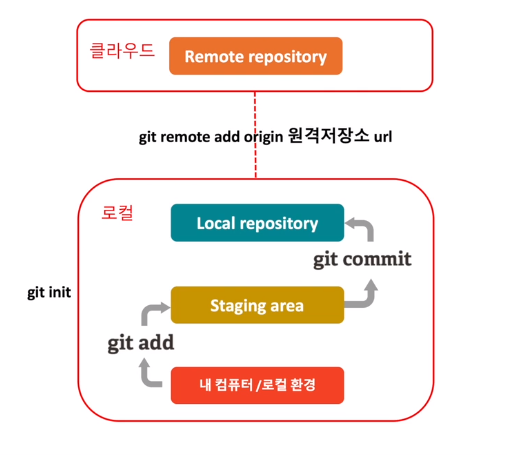
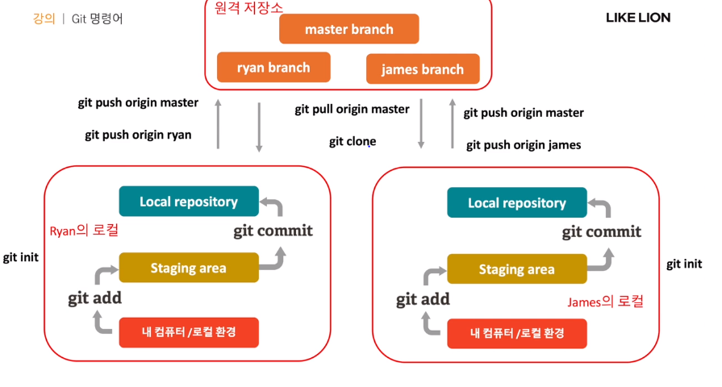

## Github 사용법 및 협업
### 기본적인 Git 명령어
* __git init__: 로컬의 git 저장소 초기화
* __git add .__: 로컬 폴더에 변경된 모든 파일 staging area에 올리기
* __git commit -m"commit 설명"__: 유사시 돌아갈 수 있는 저장소의 체크 포인트 생성 (Local 안에)
* __git remote add origin http://원격저장소주소.git__: 클라우드에 있는 원격 저장소(remote repository) 연결

### 자주쓰는 Git 
* __git branch 브랜치 명__: 새로운 브랜치를 생성
  * Branch: 한 Repository 내에서 용도에 따라 저장소를 나누는 것 (ex. 협업하는 개발자별 브랜치, 제품 출시 브랜치, 기능 브랜치 등..)
* __git cheakout 브랜치 명__: 해당 브랜치로 이동
* __git push origin 브랜치__: 원격 저장소의 특정 브랜치에 프로젝트 저장
* __git pull origin 브랜치__: 원격 저장소의 특정 브랜치에서 변경사항 Pull 해오기
* __git clone  http://원격저장소주소.git__: 원격 저장소에 있는 파일 전체 복사
* __git status__: git 저장소의 상태를 확인

EX) 제임스와 라이언이 각자의 Local 컴퓨터에서 각자의 Branch에 작업물을 올리고 Remote Repository에서 협업 진행

### Github를 사용한 협업
1. 원격 저장소 생성(Github repository 생성)
2. 팀원을 Collaborator로 추가
 * Settings → Manage access → Invite a collaborator
  * 연결된 메일을 통해 초대장 확인 가능
3. 초기 프로젝트 Push
 * 저번 주에 배운 내용 하면 됨
4. 팀원들의 로컬에 프로젝트 Pull
 * git clone http://원격저장소주소.git 활용
5. 팀원들 각자의 브랜치를 생성하여 작업
 * 자기 이름으로 된(마음대로) 브랜치 생성
6. 브랜치에 작업한 내용을 Push
 * git cheakout 브랜치 명 (자기 이름 브랜치로 이동)
 * 코드 수정
 * Git add .
 * Git status를 통해 수정내역 확인
 * git commit에 수정 내용 이름 붙여주기(Commit 이름)
 * Git push origin 자기브랜치
 * Local 자기브랜치가 Repository에 올라가면서 변경된 코드가 적용됨
 * Git Status를 통해 확인
7. Master와 merge 하기 전 pull request (전체 코드에 적용하기 전 팀원들이 확인)
 * pull request → new pull request → base와 자기브랜치 차이점을 확인
 * Create Pull Request를 통해 확인사항 상세하게 요청
8. Pull request 확인 후 Master와 merge
 * 팀원 혹은 팀장이 Pull request 확인 후 (충돌 있는지 없는지) 승인
 * Merge pull request → confirm merge
 * Repository master commit이 변경된 걸 확인 가능
 
 
### Fork를 사용한 협업(Collaborator가 아닌 상태)
1. 작업하고 싶은 Repository fork 해오기
 * Reposotory 오른쪽 상단 fork 버튼 누르기(나의 Repository에서 확인가능)
2. 자신의 로컬에서 작업
 * mkdir fork (포크 폴더 생성)
 * cd fork (포크 폴더에 들어감)
 * git clone http://원격저장소주소.git
 * code . (비주얼 코드에 들어감)
 * git status (본인이 수정한 내용 확인 가능)
3. 변경사항을 자신의 브랜치에 Push
 * git add . (변경사항 저장)
 * git commit -m "change" (변경 commit 이름 붙여주기)
 * git checkout -b bing (master에서 bing 브랜치로 전환)
 * git push origin bing (변경사항 bing 브랜치에 올림)
4. 원본 레포지토리 소유자에게 Pull request 요청
5. 소유자가 pull request를 승인하여 merge하면 자동으로 collaborator 추가
 * fork 협업자는 merge 권한이 없기 때문에 기다려야됨~ (request 삭제는 가능)
