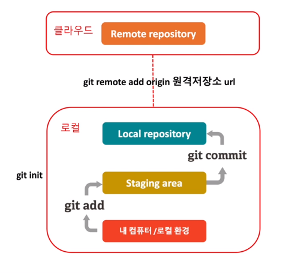

## Github 사용법 및 협업
### 자주쓰는 Git 명령어
* __git init__: 로컬의 git 저장소 초기화
* __git add .__: 로컬 폴더에 변경된 모든 파일 staging area에 올리기
* __git commit -m"commit 설명"__: 유사시 돌아갈 수 있는 저장소의 체크 포인트 생성 (Local 안에)
* __git remote add origin http://원격저장소주소.git__: 클라우드에 있는 원격 저장소(remote repository) 연결
---
* __git branch 브랜치 명__: 새로운 브랜치를 생성
  * Branch: 한 Repository 내에서 용도에 따라 저장소를 나누는 것 (ex. 협업하는 개발자별 브랜치, 제품 출시 브랜치, 기능 브랜치 등..)

* __git cheakout 브랜치 명__: 해당 브랜치로 이동
* __git push origin 브랜치__: 원격 저장소의 특정 브랜치에 프로젝트 저장
* __git pull origin 브랜치__: 원격 저장소의 특정 브랜치에서 변경사항 Pull 해오기
* __git clone  http://원격저장소주소.git__: 원격 저장소에 있는 파일 전체 복사
* __git status__: git 저장소의 상태를 확인
---
제임스와 라이언이 각자의 Local 컴퓨터에서 각자의 Branch에 작업물을 올리고 Remote Repository에서 협업 진행

### Github를 사용한 협업
